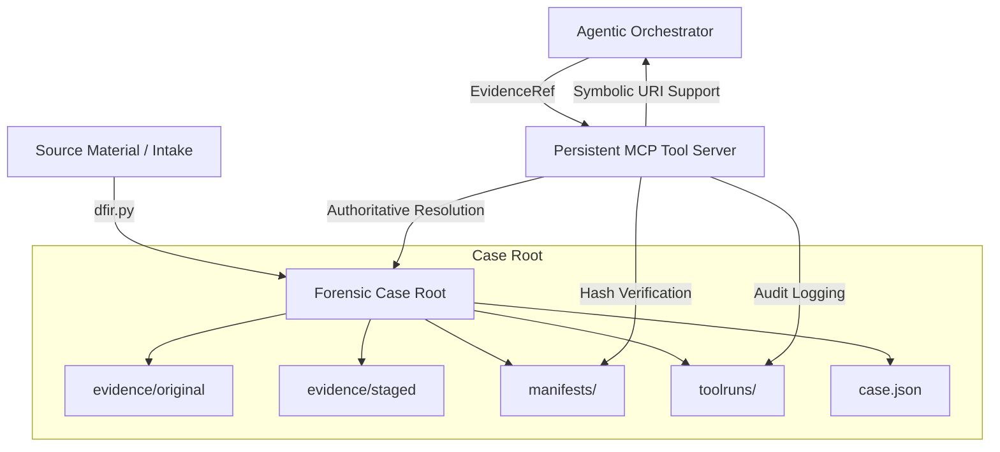

# DFIR-Agentic: Production-Ready Forensic Workstation

DFIR-Agentic is an autonomous, agent-first Digital Forensics and Incident Response (DFIR) workstation designed for high-fidelity triage, auditable evidence ingestion, and deterministic analysis.

Built on the **"Ralph Wiggum" Philosophy** (Loud Failures), the system prioritizes forensic integrity, cryptographic chain of custody, and absolute portability.

---

## 🏛️ Architecture Overview

The system follows a strict **Bipolar Architectural Model**, separating project assets (skills, tools, configs) from forensic evidence (artifacts, cases). It uses **Persistent MCP Clients** to support stateful tools like memory forensics.



---

## 🏗️ Production Lifecycle (The Automation "Factory")

1.  **Onboarding**: Point `dfir.py` at raw evidence (EVTX dir, Disk Image, or Memory Dump). It automatically identifies artifacts and creates a standardized Case Root.
2.  **Intent Selection**: The system parses your investigative `--task` and selects a specific forensic **Playbook** (e.g., `lateral_movement_v1`, `memory_triage_v1`).
3.  **Deterministic Ingestion**: Orchestrated pipelines (Plaso, Chainsaw, Hayabusa) extract timelines and detections. For memory dumps, the system skips disk-style ingestion for live memory analysis.
4.  **Autonomous Analysis**: The orchestrator chains tools (DFIR, Windows, Memory MCPs) to converge on a verified **Root Cause Analysis (RCA)**.

---

## 🚀 Quick Start (Unified Flow)

The recommended way to use DFIR-Agentic is via the unified CLI. This handles onboarding, ingestion, and orchestration in a single command.

### 1. Set Up Environment
```bash
export DEEPSEEK_API_KEY="your-key-here"
```

### 2. Run Autonomous Triage on Disk/Logs
```bash
python3 dfir.py /path/to/evidence_dir --auto --task "Detect lateral movement"
```

### 3. Run Memory Forensics
The system natively supports `.mem`, `.dd`, and `.raw` memory dumps using a multi-tier (Rust/Volatility 3) engine.
```bash
# Force the memory triage playbook for raw images
python3 dfir.py /path/to/memory.dd --auto --playbook memory_triage_v1 --task "Find the flag"
```

### 4. Tool & Execution Flags
| Argument | Description |
| :--- | :--- |
| `--auto` | Shorthand for `--mode autonomous`. The agent runs until completion. |
| `--interactive` | Run in interactive mode, prompting the analyst for approval before each tool call. |
| `--task` | The specific investigative objective or question for the AI. |
| `--playbook` | Manually select a triage workflow (e.g., `initial_access_v1`, `memory_triage_v1`). |

### 5. Local LLM Support (Air-Gapped / Offline)
DFIR-Agentic natively supports OpenAI-compatible local endpoints, such as Ollama, LM Studio, or vLLM.
| Argument | Description |
| :--- | :--- |
| `--ollama <MODEL>` | Shorthand to route to `http://localhost:11434/v1` using the specified model (e.g., `llama3.3`). |
| `--llm-base-url <URL>` | Custom base URL for your local LLM OpenAI-compatible endpoint. |
| `--llm-api-key <KEY>` | Custom API key (defaults to "ollama" if using `--ollama`). |
| `--llm-model <MODEL>` | Custom model name (required if using `--llm-base-url` without `--ollama`). |

> [!NOTE]
> When using a local LLM, the orchestrator automatically activates **Local LLM Mode**:
> - The system prompt is simplified for smaller models (~9B parameters).
> - For **memory forensics cases**, the first `memory_full_triage` call is auto-injected so the model starts with triage data already in context.
> - Disk-only tools (`list_dir`, `read_json`) are blocked for memory cases to prevent the model from thrashing.
> - The HTTP timeout is increased to 300 seconds to accommodate slower inference.
> - All of these optimizations are **skipped** when using the DeepSeek API (or any cloud provider).

---

## 🛠️ Integrated Toolset (via MCP)

| Tool | Capability | Logical Artifact |
| :--- | :--- | :--- |
| **dfir-mcp** | Unified Case Operations & Ingestion | EVTX, Plaso, Findings |
| **mem-forensics-mcp**| Stateful Memory Analysis (Volatility 3/Rust) | Memory Dumps (.dd, .mem) |
| **winforensics-mcp** | Registry & Windows Persistence | Registry Hives |
| **Hayabusa** | High-Speed EVTX Threat Hunting | `evtx_dir` |

---

## 🛡️ Forensic Standards & Guardrails

### Symbolic Case Referencing (V32)
The orchestrator uses the symbolic `CASE://` URI scheme (e.g., `CASE://intake.json`). Tools can use `"case_ref": "CASE"` to remain storage-agnostic.

### Authoritative Metadata (`case.json`)
The `case.json` file is the **Single Source of Truth**. It maps logical IDs to forensic artifacts, ensuring the agent never interacts with absolute host paths.

### Persistent MCP Connections (Stateful Tools)
To support memory forensics, the orchestrator maintains persistent JSON-RPC connections to MCP servers. This allows servers to cache heavy objects (like Volatility 3 ISF profiles) in memory across multiple tool calls.

---

## 📜 Auditing & Provenance

Every action taken by the agent is recorded in `outputs/intake/<id>/orchestrator/`:
- **`request.json` / `response.json`**: Full tool execution trace.
- **`progress.jsonl`**: Machine-readable audit of agent reasoning and findings.
- **`progress.md`**: Human-readable case notes updated in real-time.

---

> [!IMPORTANT]
> **Immutability Rule**: Never write directly to `evidence/original/` or `evidence/staged/` after ingestion. All outputs must go to `outputs/` or the `CaseFindings` stream.
