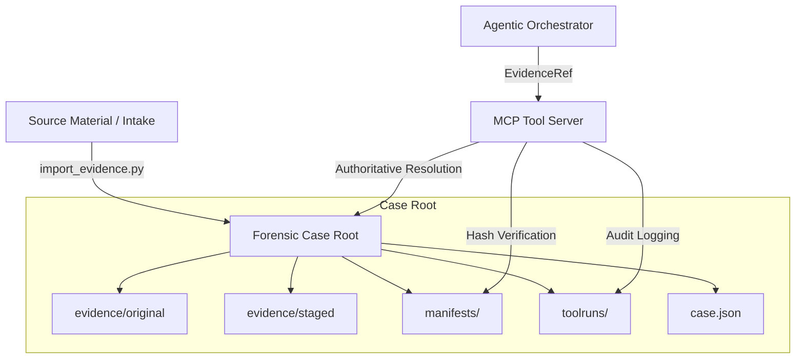

# DFIR-Agentic: Production-Ready Forensic Workstation

DFIR-Agentic is an autonomous, agent-first Digital Forensics and Incident Response (DFIR) workstation designed for high-fidelity triage, auditable evidence ingestion, and deterministic analysis.

Built on the **"Ralph Wiggum" Philosophy** (Loud Failures), the system prioritizes forensic integrity, cryptographic chain of custody, and absolute portability.

---

## 🏛️ Architecture Overview

The system follows a strict **Bipolar Architectural Model**, separating project assets (skills, tools, configs) from forensic evidence (artifacts, cases).



---

## 🚀 Quick Start (Forensic Workflow)

### 1. Initialize a New Case
Create a standardized forensic tree and the authoritative `case.json`.
```bash
python3 tools/case/init_case.py --case-id mills-sqlserver-2026-01 --root ./cases
```

### 2. Ingest Evidence
Import raw artifacts into the immutable `original/` root and establish a logical `staged/` view.
```bash
python3 tools/case/import_evidence.py \
  --case-ref cases/mills-sqlserver-2026-01/case.json \
  --type evtx_dir \
  --src /path/to/intake/evtx \
  --dest evtx/Logs \
  --stage symlink
```

### 3. Run Autonomous Triage
Invoke the agentic pipeline to perform analysis using the local MCP tools.
```bash
export DFIR_CASE_DIR="./cases/mills-sqlserver-2026-01"
python3 dfir.py --auto
```

---

## 🛡️ Forensic Standards & Guardrails

### Authoritative Metadata (`case.json`)
The `case.json` file is the **Single Source of Truth**. It contains logical mappings for all evidence artifacts, allowing the agent to resolve paths via logical IDs rather than host-specific absolute paths.

### Cryptographic Integrity (Manifests)
- **evidence.manifest.json**: SHA256 hashes of all files in `evidence/original/`.
- **staged.manifest.json**: SHA256 hashes of all normalized views in `evidence/staged/`.
- **Strict Mode**: The MCP server re-verifies high-priority artifacts against the manifest *at read time*. If a hash mismatch occurs, the operation is aborted.

### Bipolar Path Resolution
To prevent path traversal and accidental data leakage:
- **`resolve_project_path()`**: Resolves internal repo assets relative to `PROJECT_ROOT`.
- **`resolve_evidence_path()`**: Resolves forensic assets relative to `CASE_ROOT`.
- **Traversal Guard**: Any attempt to escape the `case_root` via `..` or absolute paths is instantly blocked.

---

## 🛠️ Integrated Toolset (via MCP)

| Tool | Capability | Logical Artifact |
| :--- | :--- | :--- |
| **Hayabusa** | EVTX Timeline & Threat Hunting | `evtx_dir` |
| **Plaso** | Super Timeline Querying | `plaso_file` |
| **WinForensics** | Registry Hive / Persistence Extraction | `registry_hive` |
| **Case Findings** | Unified JSON Finding Aggregation | `findings_json` |

---

## 📜 Auditing & Provenance

Every action taken by the agent is recorded in `toolruns/<run_id>/`:
- **`evidence_audit.json`**: Captures exactly which file was read, its logical `EvidenceRef`, and its verified SHA256 hash.
- **`request.json` / `response.json`**: Full trace of the tool execution.
- **`meta.json`**: Tool versioning and environment context.

---

## 🧑‍💻 Developer Setup

1. **Environment Variables**:
   - `PROJECT_ROOT`: Path to this repository.
   - `DFIR_CASE_DIR`: (Optional) Current active case for tooling.
2. **Dependencies**:
   - Python 3.10+
   - [Optional] WinForensics-MCP local build.
   - [Optional] Hayabusa Binaries in `tools/hayabusa/bin/`.

---

> [!IMPORTANT]
> **Immutability Rule**: Never write directly to `evidence/original/` or `evidence/staged/` after ingestion. All outputs must go to `outputs/` or the `CaseFindings` stream.
